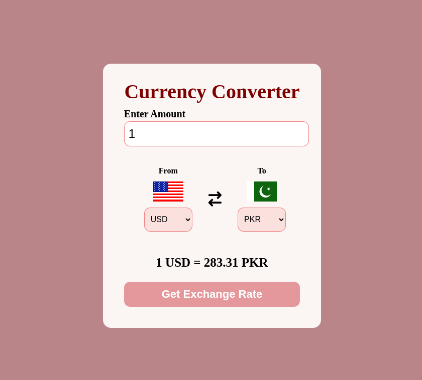

# 💱 Currency Converter

A simple and interactive **Currency Converter** web app built using **HTML**, **CSS**, and **JavaScript**. Quickly convert between different currencies with real-time exchange rates and country flags.

## 🖼️ App Preview



## 🚀 Features

- Real-time currency conversion
- Country flag display for selected currencies
- Swapping "From" and "To" currencies
- Clean and responsive design

---

## 🔧 Technologies Used

- **HTML** – Structure of the form and layout
- **CSS** – Styling and responsiveness
- **JavaScript (ES Modules)** – Dynamic data fetching and interactivity
- **Font Awesome** – Icons used for swap button
- **FlagsAPI** – Displays country flags via image URLs

---

## 🌐 Data Source

Exchange rate data is powered by the open-source [Fawaz Ahmed Currency API](https://github.com/fawazahmed0/currency-api), served via jsDelivr CDN.

---

## 📂 Project Structure

```
├── index.html
├── style.css
├── app.js
├── countryCode.js
├── app.png
└── README.md
```

---

## 📜 How to Run

1. Clone the repository:
   ```bash
   git clone https://github.com/yourusername/currency-converter.git
   ```

2. Open the `index.html` file in your browser.

---

## 🙌 Contributing

Feel free to fork this repo and submit a pull request with improvements or new features.

---

## 📃 License

This project is licensed under the [MIT License](LICENSE).