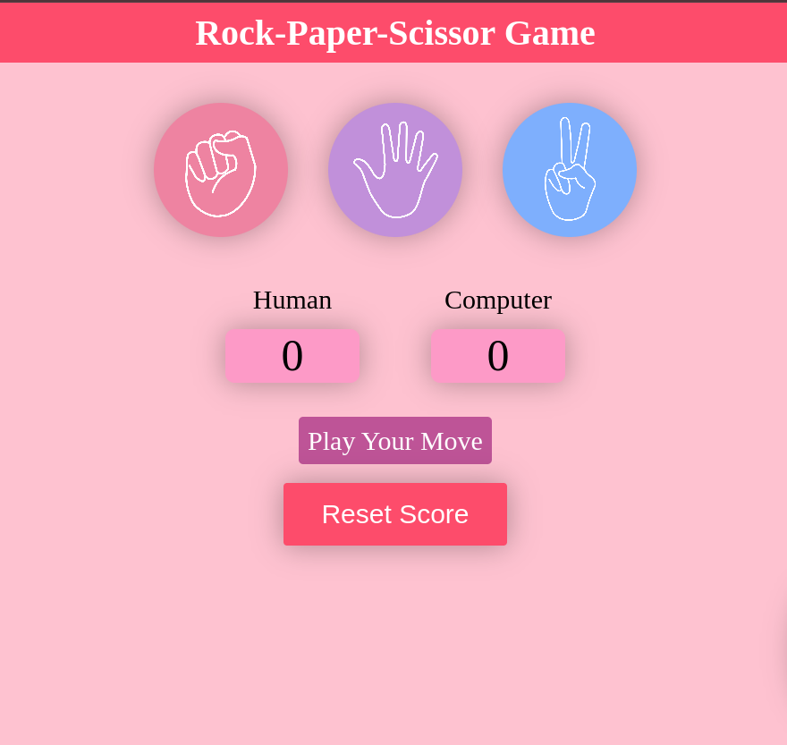

# 🎮 Rock-Paper-Scissors Game

A fun and interactive Rock-Paper-Scissors game built using HTML, CSS, and JavaScript. Challenge the computer, track the score, and enjoy the classic game with visual feedback and smooth gameplay!


## 🖼️ Game Display




## 🚀 Features

- Single-player gameplay vs Computer
- Visual representation of Rock, Paper, and Scissor
- Dynamic message display (win, lose, draw)
- Scoreboard for Human and Computer
- Reset Score functionality
- Temporary click disable to prevent multiple selections


---

## 🔧 Technologies Used

- **HTML** – Game layout and structure
- **CSS** – Responsive and clean styling
- **JavaScript** – GGame logic, DOM manipulation, and interactivity

---

## 📂 Project Structure

```
├── index.html           
├── style.css      
├── Game.png     
├── app.js              
├── images/
│   ├── rock.png
│   ├── paper.png
│   └── scissor.png
└── README.md           

```

---

## 📜 How to Run

1. Clone the repository:
   ```bash
   git clone https://github.com/yourusername/rock-paper-scissors-game.git
   ```

2. Open the `index.html` file in your browser.

---

## 🙌 Contributing

Feel free to fork this repo, suggest features, or submit a pull request to improve the game experience!

---

## 📃 License

This project is licensed under the [MIT License](LICENSE).