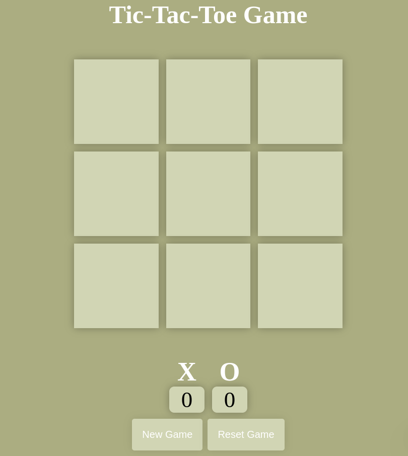

# 🎮 Tic-Tac-Toe Game

A simple and interactive Tic-Tac-Toe game built using **HTML**, **CSS**, and **JavaScript**. Play with a friend, track the wins, and enjoy the classic game in your browser!

## 🖼️ Screenshot



## 🚀 Features

- Two-player gameplay (X vs O)
- Score counter for each player
- New Game and Reset Game functionality
- Displays the winner or a draw

---

## 🔧 Technologies Used

- **HTML** – Structure of the game board
- **CSS** – Styling and layout
- **JavaScript** – Game logic and interactivity

---

## 📂 Project Structure

```
├── index.html
├── style.css
├── app.js
├── screenshot.png
└── README.md
```

---

## 📜 How to Run

1. Clone the repository:
   ```bash
   git clone https://github.com/yourusername/tic-tac-toe-game.git
   ```

2. Open the `index.html` file in your browser.

---

## 🙌 Contributing

Feel free to fork this repo and submit a pull request with improvements or new features.

---

## 📃 License

This project is licensed under the [MIT License](LICENSE).